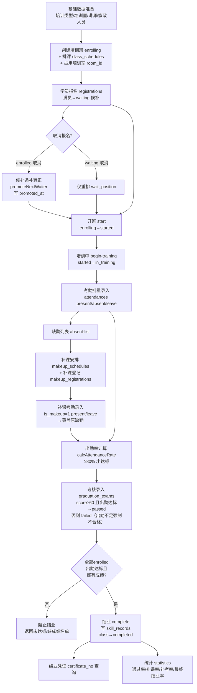

# 培训链路说明文档（顺着代码查）

> 适用对象：新人。本文按“招生 → 排课 → 占用培训室 → 报名/候补 → 考勤 → 补课 → 考核 → 结业凭证 → 技能档案回写 → 统计”的真实代码顺序，把现有实现串成一条链。所有引用均可点击跳转到对应代码行。

---

## 一、整体流程图

---

## 二、数据模型与状态机

### 2.1 状态枚举（定义在 [index.ts](file:///Users/ding/Documents/SOLOCODE%203/0618/macmini/zj-00383-teachplan-5/src/types/index.ts#L1-L9)）

| 枚举 | 取值 | 含义 |
|---|---|---|
| `ClassStatus` | `enrolling` → `started` → `in_training` → `completed` | 培训班生命周期 |
| `RegistrationStatus` | `enrolled` / `waiting` / `cancelled` | 报名状态 |
| `AttendanceStatus` | `present` / `absent` / `leave` | 考勤状态（present 与 leave 都视作“有效出勤”） |
| `ExamResult` | `passed` / `failed` / `pending` | 考核结果 |
| `MakeupScheduleStatus` | `scheduled` / `completed` / `cancelled` | 补课登记状态 |

### 2.2 核心表（建表逻辑在 [database.ts](file:///Users/ding/Documents/SOLOCODE%203/0618/macmini/zj-00383-teachplan-5/src/db/database.ts#L17-L224)）

| 表 | 作用 | 关键字段 |
|---|---|---|
| `training_classes` | 培训班 | `status`、`capacity`、`room_id`、`start/end_date` |
| `class_schedules` | 排课 / 培训室占用 | `class_id`、`date`、`start/end_time`、`room_id` |
| `registrations` | 报名 / 候补 | `status`、`wait_position`、`promoted_at` |
| `attendances` | 考勤（含补课） | `status`、`is_makeup`、`original_schedule_id`、`makeup_schedule_id` |
| `makeup_schedules` | 补课安排 | `original_schedule_id`、`room_id`、`instructor_id` |
| `makeup_registrations` | 补课登记 | `status`（scheduled/completed/cancelled） |
| `graduation_exams` | 考核 | `result`、`score`、`certificate_no`、`is_retake`、`retake_count`、`parent_exam_id` |
| `skill_records` | 技能档案（结业回写） | `certificate_no`、`attendance_rate`、`had_makeup`、`had_retake`、`was_waiting_promoted`、`makeup_count`、`retake_count` |

> 注意：`class_schedules.room_id` 是后续通过 `ALTER TABLE` 迁移加上的列（见 [database.ts](file:///Users/ding/Documents/SOLOCODE%203/0618/macmini/zj-00383-teachplan-5/src/db/database.ts#L86-L99)），创建班级时每条排课都写入班级的 `room_id`，这就是“占用培训室”的落地。

---

## 三、链路逐段拆解（按代码顺序）

### 3.1 基础数据准备
- 培训类型 / 培训室 / 讲师 / 家政人员各自独立 CRUD。
- 培训室有“可用时段查询” [trainingRooms.ts](file:///Users/ding/Documents/SOLOCODE%203/0618/macmini/zj-00383-teachplan-5/src/routes/trainingRooms.ts#L92-L133)（合并普通排课与补课排课）。

### 3.2 创建培训班 = 招生 + 排课 + 占用培训室（一步完成）
入口：[trainingClasses.ts](file:///Users/ding/Documents/SOLOCODE%203/0618/macmini/zj-00383-teachplan-5/src/routes/trainingClasses.ts#L82-L194) `POST /api/training-classes`

关键校验与动作（同一事务内）：
1. 必填：培训类型、班级名称、讲师、培训室、起止日期。
2. 班级容量不能超过培训室容量（[L127-L128](file:///Users/ding/Documents/SOLOCODE%203/0618/macmini/zj-00383-teachplan-5/src/routes/trainingClasses.ts#L127-L128)）。
3. **必须至少一条课程安排**（[L130-L133](file:///Users/ding/Documents/SOLOCODE%203/0618/macmini/zj-00383-teachplan-5/src/routes/trainingClasses.ts#L130-L133)），且排课日期须落在班级起止日期内。
4. **培训室占用冲突校验** `checkRoomScheduleConflict`（[helpers.ts](file:///Users/ding/Documents/SOLOCODE%203/0618/macmini/zj-00383-teachplan-5/src/utils/helpers.ts#L68-L130)）：同时查 `class_schedules` 与 `makeup_schedules`，避免同一培训室同一时段被两个班/补课重复占用。
5. 班级落库 `status='enrolling'`，每条排课写入 `room_id`（占用培训室）。

约束：只有 `enrolling` 的班级能改基本信息（[L276-L278](file:///Users/ding/Documents/SOLOCODE%203/0618/macmini/zj-00383-teachplan-5/src/routes/trainingClasses.ts#L276-L278)）、能删除（[L417-L419](file:///Users/ding/Documents/SOLOCODE%203/0618/macmini/zj-00383-teachplan-5/src/routes/trainingClasses.ts#L417-L419)）。改培训室会同步更新所有排课的 `room_id`（[L388-L392](file:///Users/ding/Documents/SOLOCODE%203/0618/macmini/zj-00383-teachplan-5/src/routes/trainingClasses.ts#L388-L392)）。

### 3.3 学员报名与候补
入口：[registrations.ts](file:///Users/ding/Documents/SOLOCODE%203/0618/macmini/zj-00383-teachplan-5/src/routes/registrations.ts#L70-L151) `POST /api/registrations`
- 仅 `enrolling` 班级可报名（[L82](file:///Users/ding/Documents/SOLOCODE%203/0618/macmini/zj-00383-teachplan-5/src/routes/registrations.ts#L82)）。
- 已报名（非 cancelled）拒绝重复报名（`UNIQUE(class_id, housekeeper_id)`）。
- **满员判定**：`enrolled >= capacity` → `status='waiting'`，并写入 `wait_position`（[L107-L120](file:///Users/ding/Documents/SOLOCODE%203/0618/macmini/zj-00383-teachplan-5/src/routes/registrations.ts#L107-L120)）。

### 3.4 取消报名 → 候补递补转正
入口：[registrations.ts](file:///Users/ding/Documents/SOLOCODE%203/0618/macmini/zj-00383-teachplan-5/src/routes/registrations.ts#L234-L286) `DELETE /api/registrations/:id/cancel`
- 已结业班级不可取消（[L246-L247](file:///Users/ding/Documents/SOLOCODE%203/0618/macmini/zj-00383-teachplan-5/src/routes/registrations.ts#L246-L247)）。
- 取消的是 `enrolled`：调用 `promoteNextWaiter`（[L41-L68](file:///Users/ding/Documents/SOLOCODE%203/0618/macmini/zj-00383-teachplan-5/src/routes/registrations.ts#L41-L68)），把队首候补（按 `registered_at` 升序）转正，写 `promoted_at`，并 `recalcWaitPositions` 重排队（[L25-L39](file:///Users/ding/Documents/SOLOCODE%203/0618/macmini/zj-00383-teachplan-5/src/routes/registrations.ts#L25-L39)）。
- 取消的是 `waiting`：仅重排 `wait_position`，不触发转正。
- `promoted_at` 非常关键：它决定候补转正学员只对“转正日之后”的排课计入出勤率（见 3.8）。

### 3.5 开班 / 培训中
- 开班 [trainingClasses.ts](file:///Users/ding/Documents/SOLOCODE%203/0618/macmini/zj-00383-teachplan-5/src/routes/trainingClasses.ts#L425-L461) `POST /:id/start`：`enrolling → started`。前置条件：有正式学员、有排课、有培训室占用记录。
- 培训中 [trainingClasses.ts](file:///Users/ding/Documents/SOLOCODE%203/0618/macmini/zj-00383-teachplan-5/src/routes/trainingClasses.ts#L463-L479) `POST /:id/begin-training`：`started → in_training`（也可从 `in_training` 自身循环）。
- 考勤、考核、补课考勤都要求班级处于 `started` 或 `in_training`。

### 3.6 考勤录入
入口：[attendances.ts](file:///Users/ding/Documents/SOLOCODE%203/0618/macmini/zj-00383-teachplan-5/src/routes/attendances.ts#L16-L81) `POST /api/attendances/batch`
- `upsert` 按 `(schedule_id, housekeeper_id)` 唯一约束覆盖更新（重复录以最后一次为准）。
- `present`/`absent`/`leave`，非法值回落 `present`。

### 3.7 缺勤与补课闭环
- 缺勤列表 [attendances.ts](file:///Users/ding/Documents/SOLOCODE%203/0618/macmini/zj-00383-teachplan-5/src/routes/attendances.ts#L265-L275) → `getAbsentList`（[helpers.ts](file:///Users/ding/Documents/SOLOCODE%203/0618/macmini/zj-00383-teachplan-5/src/utils/helpers.ts#L321-L383)）：逐课逐人判定是否缺勤，并标注是否已安排补课。
- 补课安排 [attendances.ts](file:///Users/ding/Documents/SOLOCODE%203/0618/macmini/zj-00383-teachplan-5/src/routes/attendances.ts#L277-L360) `POST /makeup/schedule`：挂到某条 `original_schedule_id`，做培训室冲突校验 `checkMakeupRoomScheduleConflict`（[helpers.ts](file:///Users/ding/Documents/SOLOCODE%203/0618/macmini/zj-00383-teachplan-5/src/utils/helpers.ts#L132-L178)）。
- 补课登记 [attendances.ts](file:///Users/ding/Documents/SOLOCODE%203/0618/macmini/zj-00383-teachplan-5/src/routes/attendances.ts#L420-L472) `POST /makeup/register`：写入 `makeup_registrations`，状态 `scheduled`。
- 补课考勤 [attendances.ts](file:///Users/ding/Documents/SOLOCODE%203/0618/macmini/zj-00383-teachplan-5/src/routes/attendances.ts#L474-L552) `POST /makeup/attendance`：写入 `attendances`，`is_makeup=1`，并用伪 `schedule_id = makeup_${id}`；`present/leave` 时把对应 `makeup_registrations` 置 `completed`。

> 补课之所以能“抹平”缺勤，关键在出勤率算法对 `is_makeup=1` 且 `present/leave` 的记录，会把其 `original_schedule_id` 计入“已覆盖”。

### 3.8 出勤率计算（结业资格的核心门槛）
核心函数 [calcAttendanceRate](file:///Users/ding/Documents/SOLOCODE%203/0618/macmini/zj-00383-teachplan-5/src/utils/helpers.ts#L204-L255)：
1. 取 `promoted_at`，若存在则只统计转正日当天及之后的排课（候补转正学员不对转正前的课负责）。
2. 对每节适用排课：原考勤 `present/leave` 计有效；或被补课 `makeupCovered` 覆盖计有效。
3. `有效数 / 适用排课数 * 100`，保留两位小数。
4. 达标线 `MIN_REQUIRED_ATTENDANCE_RATE = 80`（[helpers.ts L180](file:///Users/ding/Documents/SOLOCODE%203/0618/macmini/zj-00383-teachplan-5/src/utils/helpers.ts#L180)），由 [hasSufficientAttendance](file:///Users/ding/Documents/SOLOCODE%203/0618/macmini/zj-00383-teachplan-5/src/utils/helpers.ts#L257-L263) 判定。

### 3.9 考核录入
入口：[graduation.ts](file:///Users/ding/Documents/SOLOCODE%203/0618/macmini/zj-00383-teachplan-5/src/routes/graduation.ts#L32-L178) `POST /api/graduation/exam`
- 仅 `started/in_training`、且为 `enrolled` 学员可录入。
- 及格线 60：`score >= 60` → `passed`，否则 `failed`。
- **出勤率不足强制不合格**：若 `!hasSufficientAttendance` 且分数本应通过，则 `result` 改写为 `failed`（[L78-L81](file:///Users/ding/Documents/SOLOCODE%203/0618/macmini/zj-00383-teachplan-5/src/routes/graduation.ts#L78-L81)）。
- 只有 `passed` 才生成 `certificate_no`（[generateCertificateNo](file:///Users/ding/Documents/SOLOCODE%203/0618/macmini/zj-00383-teachplan-5/src/routes/graduation.ts#L22-L30)，格式 `HZ + ymd + 6位随机`）。
- 补考：已存在记录则更新，`retake_count+1`、`is_retake=1`、`parent_exam_id` 指向原记录；已 `passed` 拒绝再考（[L95-L105](file:///Users/ding/Documents/SOLOCODE%203/0618/macmini/zj-00383-teachplan-5/src/routes/graduation.ts#L95-L105)）。

### 3.10 结业 + 技能档案回写
入口：[graduation.ts](file:///Users/ding/Documents/SOLOCODE%203/0618/macmini/zj-00383-teachplan-5/src/routes/graduation.ts#L203-L447) `POST /api/graduation/class/:classId/complete`

结业前置闸门（任一不满足都直接拒绝结业）：
1. 班级 `started/in_training`、有排课。
2. **所有 `enrolled` 学员出勤率均达标**，否则返回未达标名单（[L236-L256](file:///Users/ding/Documents/SOLOCODE%203/0618/macmini/zj-00383-teachplan-5/src/routes/graduation.ts#L236-L256)）。
3. 至少录入过一条非 `pending` 成绩。
4. **所有 `enrolled` 学员都有考核成绩**，否则返回缺成绩名单（[L269-L281](file:///Users/ding/Documents/SOLOCODE%203/0618/macmini/zj-00383-teachplan-5/src/routes/graduation.ts#L269-L281)）。

事务内动作：
- 对“`passed` 且出勤达标”的学员写 `skill_records`（已存在则跳过，幂等），档案里回写 `had_makeup/had_retake/was_waiting_promoted/makeup_count/retake_count/attendance_rate`（[L283-L334](file:///Users/ding/Documents/SOLOCODE%203/0618/macmini/zj-00383-teachplan-5/src/routes/graduation.ts#L283-L334)）。
- 班级 `status → completed`。
- 返回结业汇总：通过率、补课率、补考率、候补转正数、最终结业率。

### 3.11 结业凭证查询
入口：[graduation.ts](file:///Users/ding/Documents/SOLOCODE%203/0618/macmini/zj-00383-teachplan-5/src/routes/graduation.ts#L488-L507) `GET /api/graduation/certificate/:certificateNo`，按 `certificate_no` 查 `skill_records`。

### 3.12 统计口径
入口 [statistics.ts](file:///Users/ding/Documents/SOLOCODE%203/0618/macmini/zj-00383-teachplan-5/src/routes/statistics.ts)：
- `/overview`（[L19-L243](file:///Users/ding/Documents/SOLOCODE%203/0618/macmini/zj-00383-teachplan-5/src/routes/statistics.ts#L19-L243)）：通过率**只统计出勤达标学员**（`eligibleExams`）；最终结业率 = `skill_records 数 / enrolled 数`。
- `/by-training-type`（[L245-L429](file:///Users/ding/Documents/SOLOCODE%203/0618/macmini/zj-00383-teachplan-5/src/routes/statistics.ts#L245-L429)）：按培训类型聚合，同样仅计入出勤达标者。
- `/room-utilization`（[L431-L559](file:///Users/ding/Documents/SOLOCODE%203/0618/macmini/zj-00383-teachplan-5/src/routes/statistics.ts#L431-L559)）：培训室使用率**排除 `enrolling` 班级**，含补课排课。
- `/instructor-workload`、`/monthly-trend`：讲师工作量、月度趋势。

---

## 四、关键区分：哪些状态影响结业资格/统计，哪些只留痕

### 4.1 影响结业资格或统计口径（改了会改变结果）

| 字段/状态 | 影响点 | 代码位置 |
|---|---|---|
| `training_classes.status = completed` | 决定是否计入“最终结业率”、培训室使用率是否纳入 | [graduation.ts L335-L337](file:///Users/ding/Documents/SOLOCODE%203/0618/macmini/zj-00383-teachplan-5/src/routes/graduation.ts#L335-L337)、[statistics.ts L464-L465](file:///Users/ding/Documents/SOLOCODE%203/0618/macmini/zj-00383-teachplan-5/src/routes/statistics.ts#L464-L465) |
| `registrations.status = enrolled` | 统计报名数、结业分母、要求其出勤/成绩齐全 | 结业闸门 [graduation.ts L220-L256](file:///Users/ding/Documents/SOLOCODE%203/0618/macmini/zj-00383-teachplan-5/src/routes/graduation.ts#L220-L256) |
| `attendances.status ∈ {present, leave}` | 计入有效出勤，直接抬升出勤率 | [helpers.ts L243-L252](file:///Users/ding/Documents/SOLOCODE%203/0618/macmini/zj-00383-teachplan-5/src/utils/helpers.ts#L243-L252) |
| `attendances.is_makeup=1` 且 `present/leave` | 覆盖原 `original_schedule_id` 的缺勤，间接抬升出勤率 | [helpers.ts L232-L240](file:///Users/ding/Documents/SOLOCODE%203/0618/macmini/zj-00383-teachplan-5/src/utils/helpers.ts#L232-L240) |
| 出勤率 ≥ 80% | **结业资格硬门槛**：不达标则强制考核 failed、且阻止整班结业 | [graduation.ts L79-L81](file:///Users/ding/Documents/SOLOCODE%203/0618/macmini/zj-00383-teachplan-5/src/routes/graduation.ts#L79-L81)、[L236-L256](file:///Users/ding/Documents/SOLOCODE%203/0618/macmini/zj-00383-teachplan-5/src/routes/graduation.ts#L236-L256) |
| `graduation_exams.result = passed` 且出勤达标 | 才生成 `certificate_no`、才写 `skill_records` | [graduation.ts L82-L83](file:///Users/ding/Documents/SOLOCODE%203/0618/macmini/zj-00383-teachplan-5/src/routes/graduation.ts#L82-L83)、[L283-L290](file:///Users/ding/Documents/SOLOCODE%203/0618/macmini/zj-00383-teachplan-5/src/routes/graduation.ts#L283-L290) |
| `registrations.promoted_at` 非空 | 收窄候补转正学员的“适用排课”范围，影响其出勤率 | [helpers.ts L208-L219](file:///Users/ding/Documents/SOLOCODE%203/0618/macmini/zj-00383-teachplan-5/src/utils/helpers.ts#L208-L219) |
| `skill_records` 是否存在 | 计入“最终结业率”分子 | [statistics.ts L128-L138](file:///Users/ding/Documents/SOLOCODE%203/0618/macmini/zj-00383-teachplan-5/src/routes/statistics.ts#L128-L138) |

### 4.2 只保存记录、不改变结业资格（留痕/描述用）

| 字段/记录 | 为什么不影响资格 | 代码位置 |
|---|---|---|
| `makeup_schedules` / `makeup_registrations` 计划本身 | 只是“计划补课”，真正起作用的是补课考勤 `is_makeup=1 present/leave` | [attendances.ts L277-L360](file:///Users/ding/Documents/SOLOCODE%203/0618/macmini/zj-00383-teachplan-5/src/routes/attendances.ts#L277-L360)、[L420-L472](file:///Users/ding/Documents/SOLOCODE%203/0618/macmini/zj-00383-teachplan-5/src/routes/attendances.ts#L420-L472) |
| `makeup_registrations.status`（scheduled/completed/cancelled） | 仅跟踪补课流程状态，不参与出勤率判定 | [attendances.ts L510-L531](file:///Users/ding/Documents/SOLOCODE%203/0618/macmini/zj-00383-teachplan-5/src/routes/attendances.ts#L510-L531) |
| `graduation_exams.is_retake` / `retake_count` / `parent_exam_id` | 仅记录补考历史；决定资格的是当前 `result` | [graduation.ts L91-L105](file:///Users/ding/Documents/SOLOCODE%203/0618/macmini/zj-00383-teachplan-5/src/routes/graduation.ts#L91-L105) |
| `skill_records.had_makeup/had_retake/was_waiting_promoted` 及各 `*_count` | 结业回写时的描述性元数据，供统计展示，不影响“是否结业” | [graduation.ts L298-L333](file:///Users/ding/Documents/SOLOCODE%203/0618/macmini/zj-00383-teachplan-5/src/routes/graduation.ts#L298-L333) |
| `attendances.remark` | 备注文本 | [attendances.ts L40-L47](file:///Users/ding/Documents/SOLOCODE%203/0618/macmini/zj-00383-teachplan-5/src/routes/attendances.ts#L40-L47) |
| `registrations.status = waiting / cancelled` 及 `wait_position` | 不计入 `enrolled` 统计与结业分母；`wait_position` 仅排队用 | [registrations.ts L107-L120](file:///Users/ding/Documents/SOLOCODE%203/0618/macmini/zj-00383-teachplan-5/src/routes/registrations.ts#L107-L120) |
| `graduation_exams.result = pending` | 占位值，统计时被 `result != 'pending'` 过滤 | [graduation.ts L260-L261](file:///Users/ding/Documents/SOLOCODE%203/0618/macmini/zj-00383-teachplan-5/src/routes/graduation.ts#L260-L261)、[statistics.ts L73-L74](file:///Users/ding/Documents/SOLOCODE%203/0618/macmini/zj-00383-teachplan-5/src/routes/statistics.ts#L73-L74) |

> 一句话记忆：**“出勤率 ≥ 80%”与“考核 passed 且出勤达标”是唯二的两道资格闸；其余补课/补考/候补相关字段，要么通过影响出勤率间接起作用，要么只是写进档案供统计展示。**

---

## 五、新人自查路径

1. 跑通闭环：执行 [test_closed_loop.mjs](file:///Users/ding/Documents/SOLOCODE%203/0618/macmini/zj-00383-teachplan-5/test_closed_loop.mjs)（覆盖报名超员→候补转正→缺勤→补课→补考→结业→统计全链路）。
2. 看状态机：先读 [types/index.ts](file:///Users/ding/Documents/SOLOCODE%203/0618/macmini/zj-00383-teachplan-5/src/types/index.ts#L1-L9) 的五个枚举。
3. 看建表：[database.ts](file:///Users/ding/Documents/SOLOCODE%203/0618/macmini/zj-00383-teachplan-5/src/db/database.ts#L17-L224)，注意外键级联（`class_schedules/registrations/attendances/makeup_*` 删班级级联）。
4. 看核心算法：出勤率 [calcAttendanceRate](file:///Users/ding/Documents/SOLOCODE%203/0618/macmini/zj-00383-teachplan-5/src/utils/helpers.ts#L204-L255)、资格闸门 [graduation complete](file:///Users/ding/Documents/SOLOCODE%203/0618/macmini/zj-00383-teachplan-5/src/routes/graduation.ts#L203-L447)。
5. 看统计口径：[statistics overview](file:///Users/ding/Documents/SOLOCODE%203/0618/macmini/zj-00383-teachplan-5/src/routes/statistics.ts#L19-L243) 的 `eligibleExams` 过滤逻辑。
